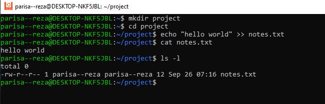
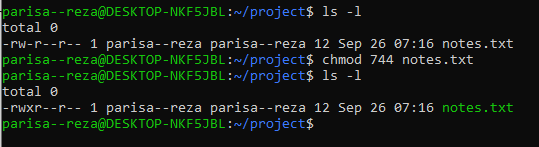
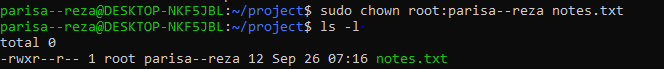

# Linux Task: File Permissions and Ownership

## Solution

1. I created a directory called `project`.Inside the directory, I created a file named `notes.txt`and added some sample text to the file using `echo`.

2. Checked for the default file permissions
   
   
   Here the user has read and write permission whereas group and other users have only read permission. 

   
4. Modified file permissions
   - Removed the **write permission** for the group.
   - Added **execute permission** for the owner.

   

   Here the execution permission for the owner has been added.There was no writing permission for the group in the first place.

5. Changed the owner of `notes.txt` to the `root` user displaying  the final permissions and ownership .

    

