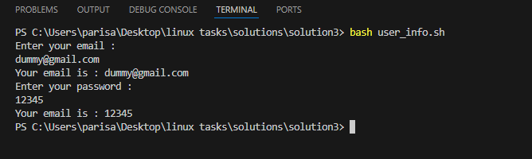

# Bash Task: Read and Print Email & Password

## Solution
I wrote a **bash/shell script** that named **`user_info.sh`** asks the user to enter their **email** and **password**, and then prints a confirmation message in the format:

   ## Script :

   ```bash
   #!bin/bash

    echo "Enter your email :"
    read email #takes input from user
    echo "Your email is : $email"

    echo "Enter your password :"
    read password
    echo "Your email is : $password"

   ```


## Expected Output

